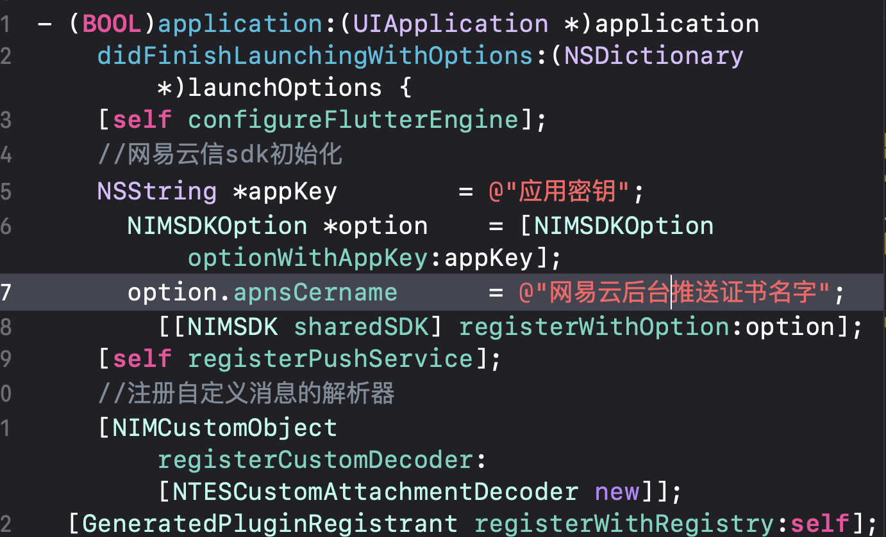
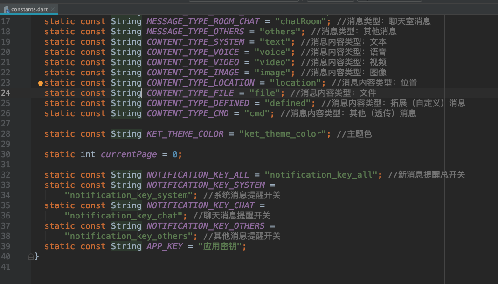

# flutter_server_client
基于网易云信sdk的Flutter聊天脚手架,主要对网易云信在Android和iOS原生端的聊天api进行了封装，对Android和iOS消息体的不同差异在Flutter端进行了抹平操作，
实现了登录、获取最近聊天会话、会话监听、聊天消息监听、onKick被踢单点登录监听，普通文本、emoji、图片、语音的发送和接受、自定义消息的解析和展示、以及历史聊天记录获取等功能，
只需简单在iOS端和Flutter端配置一下appkey就可直接账号登录查看，是一个开箱即用的Flutter聊天脚手架；

### key修改地方

### iOS效果图

### Android效果图

